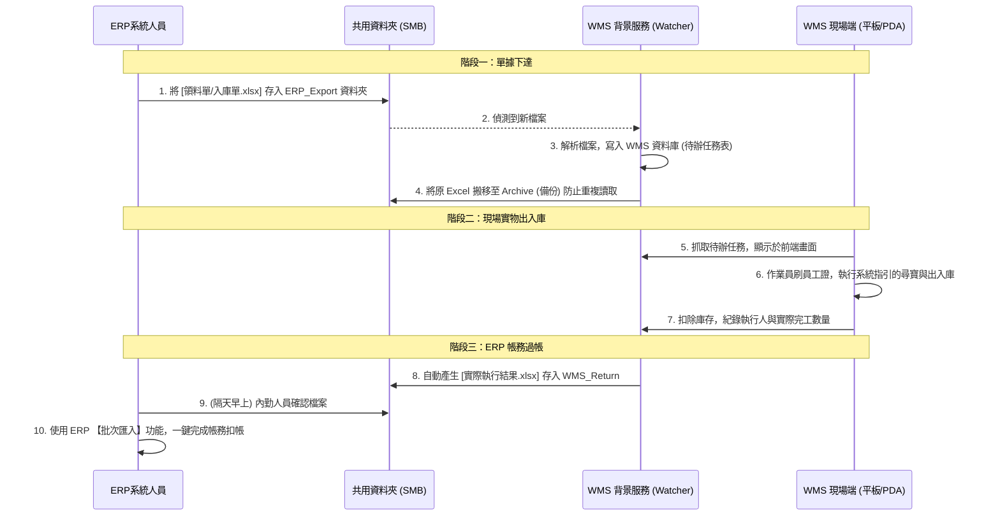

# WMS 系統結合 ERP 系統開發方向與架構規劃

針對目前工廠實務現況（ERP 無開放 API，僅能透過檔案匯出/匯入），本系統將採用 **「檔案交換（File-based Integration / Hot Folder）」** 的非同步架構來達成 WMS 與 ERP 的雙向對接。

此架構具備極高的容錯性與系統解耦（Decoupling）特性：ERP 發生停機或下線皆不影響 WMS 現場運作，雙方各自獨立運作且互不干擾。

---

## 1. 系統職責劃分 (System Boundaries)

在整合設計中，堅守以下職責分離原則，以避免邏輯衝突：

*   **ERP 系統（負責「總帳」與「單據」）**：
    *   管理料件總數量與成本。
    *   負責生管單據（如：領料單、入庫單、採購單）的開立。
    *   **不需**控管料件在倉庫中的實體儲位 (X,Y,Z)。
*   **WMS 系統（負責「實物」與「即時定位」）**：
    *   精確記錄某料件的具體儲位與對應數量（例如：料號 A 有 200 個在 A-01-01，300 個在 B-02-03）。
    *   規劃最短揀貨路線、防呆驗證。
    *   **不需**理會料件的採購成本或單價。

---

## 2. 核心作業流程圖

---

## 3. 技術實作重點 (WMS 端)

### 3.1 背景檔案監控服務 (Watcher)
*   **套件使用**：利用 Node.js 的 `chokidar` 監控共用資料夾，搭配 `xlsx` 處理各類 Excel 檔案。
*   **狀態管理**：資料夾需規劃為三種類別：
    *   `WATCH_DIR`：接收新進入的單據。
    *   `ARCHIVE_DIR`：檔案成功解析與匯入 DB 後的存放處。
    *   `ERROR_DIR`：檔案格式錯誤或解析失敗的存放處（需通知管理員）。
*   **冪等性 (Idempotency)**：讀取檔案時，必須以「單號 (Order No)」為唯一索引，防範同一份單據被重複讀取而導致數量重複疊加。

### 3.2 現場作業人員識別 (Operator Tracking)
為滿足稽核並避免複雜的鍵盤輸入，採 **「條碼刷卡制」**：
1.  為每位倉管人員發行一維/二維條碼員工證（如 `EMP-001`）。
2.  WMS 前端作業頁面強制要求「先刷員工證」，若無識別卡則【確認】按鈕為 Disabled。
3.  資料庫出入庫紀錄表 (`inventory_transactions`) 與待辦單據表 (`pending_tasks`) 皆新增欄位：
    *   `created_by`: 單據由誰建立（讀取自 ERP 檔案）。
    *   `executed_by`: 實際搬生物料的現場作業員。

### 3.3 結果匯出與回饋給 ERP
*   配置排程（cron job）或由現場人員於下班前手動點擊「產出 ERP 確認檔」。
*   WMS 端嚴格把關：匯出檔案的**欄位排序與格式**，必須 100% 吻合 ERP 的「標準匯入範本 (Template)」，以達成內勤人員「無腦匯入」的目標。

---

## 4. 前期環境與 ERP 系統確認事項

在開始實作前，須與 IT / ERP 管理人確認以下項目：

1.  **資料夾權限**：架設 WMS Server 的主機，是否有全權讀寫該共用資料夾的權限。
2.  **單據匯出格式**：請提供 ERP 匯出的領料/入庫單 Excel 範例，以便 WMS 端針對欄位（如單號、料號、數量）寫腳本對接。
3.  **ERP 匯入模組檢查**：
    *   確認 ERP 系統擁有「批次匯入 / Excel 轉入」功能。
    *   索取 ERP 要求吃的「標準匯入格式空白範本」。
    *   確認 ERP 匯入時若遇報錯（例如料號不存在）的防呆機制為何。
    *   進階詢問：ERP 是否支援「自動排程掃描資料夾匯入」功能。如有，則可實現全自動無人化過帳。
